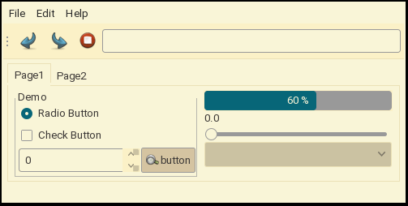

# oomox-gruvish



This is a Gruvbox Light theme for GTK I made a while back for myself.
It's probably good for other people.

## Installation
```
$ cd .themes/
$ git clone --depth=1 https://github.com/prettykool/oomox-gruvish.git
$ # ???
$ # Profit
```

## License
0BSD/Public Domain. If you can make something better, do it.
